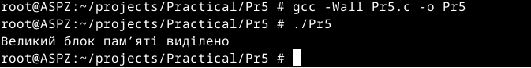

# Практична робота №5
Цей репозиторій cтворений для перегляду виконання практичної роботи №5 з дисципліни "Архітектура системного програмного забезпечення", виконане студентом Щур Р.І., групи ТВ-32.

## Завдання №1
Напишіть утиліту, яка перевіряє ефект фрагментації у великій кількості дрібних алокацій і спроб нових виділень.

## Виконання

Виконавши команди, видно, що при стандартних налаштуваннях Docker неможливо встановити soft ліміт, який перевищує hard ліміт; його можна змінювати лише в межах hard ліміту.
